# Portfolio Site

A personal portfolio site built with **React + Vite + Tailwind CSS**, deployed to **AWS S3 + CloudFront** via **AWS CDK (Python)**.

## Architecure

```mermaid
flowchart TD
    User(["👤 User"])

    subgraph AWS ["AWS — us-east-1"]
        CF["☁️ CloudFront Distribution\nHTTPS · OAC · SPA error pages"]
        OAC["Origin Access Control"]
        S3["🪣 S3 Bucket\nPrivate · website/dist"]
    end

    User -->|"HTTPS request"| CF
    CF -->|"Authenticated fetch via OAC"| OAC
    OAC --> S3

    style AWS fill:#f0f4ff,color:#0d1117,stroke:#527FFF
    style CF fill:#dce8ff,color:#0d1117,stroke:#527FFF
    style OAC fill:#dce8ff,color:#0d1117,stroke:#527FFF
    style S3 fill:#d4edda,color:#0d1117,stroke:#3F8624
```



## Project Structure

```
.
├── website/                  # React/Vite frontend
│   ├── src/
│   │   ├── App.jsx           # Main app & portfolio content
│   │   ├── main.jsx          # React entry point
│   │   ├── index.css         # Tailwind CSS import
│   │   └── assets/images/    # Custom images (add yours here)
│   ├── public/               # Static assets
│   ├── index.html            # Vite HTML entry point
│   ├── vite.config.js
│   └── package.json
├── portfolio_site/           # CDK stack (Python)
│   └── portfolio_site_stack.py
├── app.py                    # CDK app entry point
└── requirements.txt          # Python CDK dependencies
```

---

## Local Development

```bash
cd website
npm install       # first time only
npm run dev       # starts dev server at http://localhost:5173
```

---

## Deploying to AWS

Every deploy requires two steps: **build the frontend**, then **deploy the CDK stack**.

### 1. Build the frontend

```bash
cd website
npm run build     # outputs production files to website/dist/
```

### 2. Activate the Python virtual environment (first time setup)

**Windows:**
```bat
.venv\Scripts\activate.bat
```

**macOS / Linux:**
```bash
source .venv/bin/activate
```

If the virtualenv doesn't exist yet:
```bash
python -m venv .venv
pip install -r requirements.txt
```

### 3. Deploy with CDK

From the repo root:
```bash
cdk deploy
```

CDK will:
- Upload `website/dist/` to the private S3 bucket
- Invalidate the CloudFront cache (`/*`)
- Print the CloudFront URL on completion

> **First deploy only:** you may need to bootstrap the AWS environment first:
> ```bash
> cdk bootstrap
> ```

---

## Useful CDK Commands

| Command       | Description                                       |
|---------------|---------------------------------------------------|
| `cdk synth`   | Emit the synthesized CloudFormation template      |
| `cdk diff`    | Compare deployed stack with local changes         |
| `cdk deploy`  | Deploy stack to your default AWS account/region   |
| `cdk destroy` | Tear down the stack and all resources             |
| `cdk ls`      | List all stacks in the app                        |
